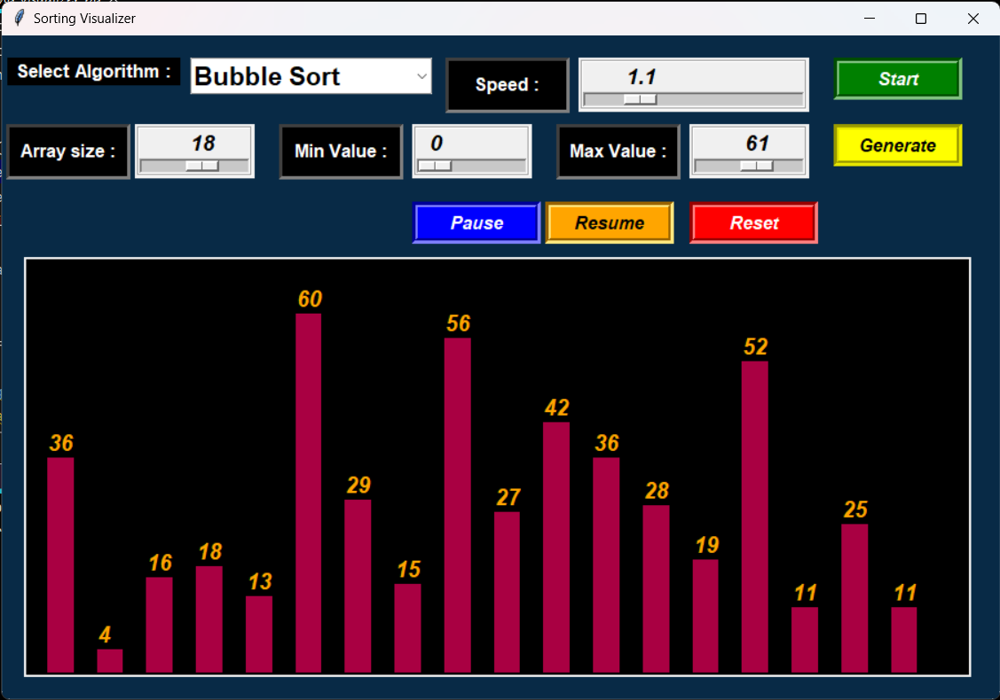

# Sorting Algorithms Visualization

[](https://opensource.org/licenses/MIT)

A Python application that visualizes various sorting algorithms using Tkinter Python libraries. This project provides a visual representation of how different sorting algorithms work, allowing users to observe and analyze their performance.



## Table of Contents

- [Features](#features)
- [Installation](#installation)
- [Usage](#usage)
- [Contributing](#contributing)
- [License](#license)

## Features

- Visualizes popular sorting algorithms, including:
  - Bubble Sort
  - Selection Sort
  - Insertion Sort
  - Merge Sort
  - Quick Sort
  - Heap Sort

- Allows users to customize the input size, delay between each step, and color scheme.
- Provides step-by-step visualization of the sorting process, making it easy to understand how the algorithms work.
- Displays statistics such as the number of comparisons and swaps performed by each algorithm.
- Supports pausing, resuming, and resetting the visualization.

## Installation

1. Clone the repository:

   ```bash
   git clone https://github.com/balaganesh102004/Sorting-Visualizer.git
   ```

2. Navigate to the project directory:

   ```bash
   cd Sorting-Visualization
   ```

3. Install the required dependencies:

   ```bash
   pip install -r requirements.txt
   ```

## Usage

1. Run the application:

   ```bash
   python sorting visualizer.py
   ```

2. Choose a sorting algorithm from the available options.
3. Adjust the input size, delay, minimum and maximum values according to your preferences.
4. Click the "Start" button to begin the visualization.
5. Observe the step-by-step visualization and analyze the sorting process.
6. Use the pause, resume, and reset buttons to control the visualization.

## Contributing

Contributions to this project are welcome and encouraged! If you would like to contribute, please follow these steps:

1. Fork the repository.
2. Create a new branch for your feature or bug fix.
3. Make your changes and commit them with descriptive commit messages.
4. Push your changes to your fork.
5. Submit a pull request, explaining the changes you made and why they should be merged.

## License

This project is licensed under the MIT License. See the [LICENSE](LICENSE) file for more details.
